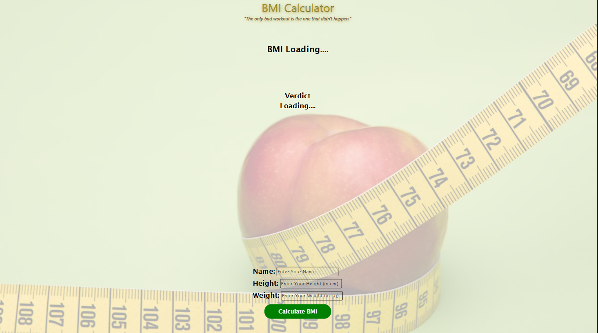
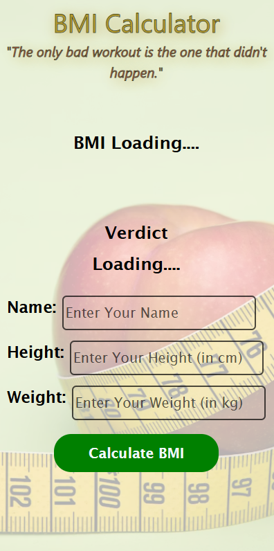

# 🏋️ BMI Calculator v1

A clean, responsive **Body Mass Index (BMI) Calculator** built with vanilla HTML, CSS, and JavaScript — styled with Tailwind CSS. Enter your name, height, and weight to instantly get your BMI value and health category.

---

## 📸 Screenshots


| Desktop View | Mobile View |
|---|---|
|  |  |

---

## ✨ Features

- 📊 **Instant BMI Calculation** — Calculates BMI using the standard formula as soon as you click the button
- 🏷️ **Health Category Display** — Shows whether you're Underweight, Healthy Weight, Overweight, or Obese (with color coding)
- ⏳ **Auto-Reset Timer** — Results automatically disappear after 10 seconds with a live countdown
- 📱 **Responsive Design** — Works well on mobile, tablet, and desktop screens
- 🖼️ **Background Image** — Subtle fitness-themed background for visual appeal
- 🔗 **Wikipedia Link** — Clickable "BMI" link for users who want to learn more

---

## 🚀 Getting Started

### Prerequisites

- A modern web browser (Chrome, Firefox, Edge, Safari)
- [Node.js](https://nodejs.org/) — only needed if you want to rebuild Tailwind CSS

### Installation

1. **Clone the repository**
   ```bash
   git clone https://github.com/your-username/bmi-calculator.git
   cd bmi-calculator
   ```

2. **Open the project**

   Simply open `index.html` in your browser — no build step needed to run the app.

   ```bash
   # Or use a live server (e.g. with VS Code Live Server extension)
   open index.html
   ```

3. _(Optional)_ **Rebuild Tailwind CSS**

   If you make changes to the Tailwind classes, regenerate the output file:
   ```bash
   npm install
   npx tailwindcss -i ./src/input.css -o ./src/output.css --watch
   ```

---

## 🧮 How It Works

1. Enter your **Name**, **Height** (in cm), and **Weight** (in kg)
2. Click the **"Calculate BMI"** button
3. Your BMI score and health category are displayed instantly

### BMI Formula

```
BMI = Weight (kg) / Height (m)²
```

### BMI Categories

| BMI Range | Category | Color |
|---|---|---|
| Below 18.5 | Underweight | 🔵 Blue |
| 18.5 – 24.9 | Healthy Weight | 🟢 Green |
| 25.0 – 29.9 | Overweight | 🟠 Orange |
| 30.0 and above | Obese | 🔴 Red |

---

## 📁 Project Structure

```
bmi-calculator/
├── index.html          # Main HTML file
├── scripts.js          # JavaScript logic
├── src/
│   ├── bmi.png         # Favicon
│   ├── mobile-view.png # Mobile View
│   ├── desktop-view.png # Desktop View
│   ├── input.css       # Tailwind input (if used)
│   └── output.css      # Compiled Tailwind CSS
└── README.md
```

---

## 🛠️ Built With

- **HTML5** — Structure
- **CSS3** — Custom styling
- **Tailwind CSS** — Utility-first responsive classes
- **Vanilla JavaScript** — BMI logic and DOM manipulation

---

## 📄 License

This project is open source and available under the [MIT License](./LICENSE).

---

## 🙋‍♂️ Author

**Your Name**
- GitHub: [MANEEVAR1](https://github.com/MANEEVAR1)

---

> _"The only bad workout is the one that didn't happen."_