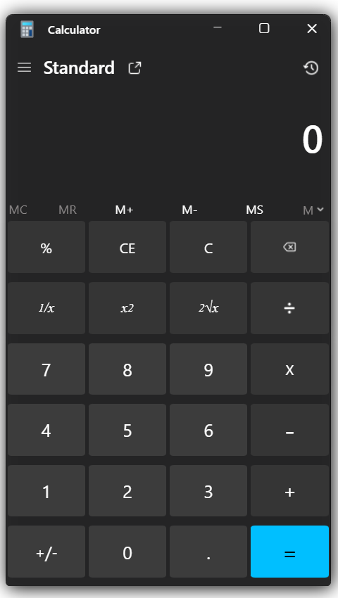

# 🧮 Windows 11 Calculator Clone

A pixel-faithful front-end clone of the Windows 11 built-in Calculator app, built as a hands-on practice project for **CSS Flexbox & Grid**.

---

## 📸 Preview



---

## 🛠️ Built With

- **HTML5** — Semantic structure and layout
- **CSS3** — Flexbox & Grid for layout, custom styling
- **Media Queries** — Basic responsiveness across screen sizes

---

## 🎯 Purpose

This project was built purely for practice. The goal was to replicate the look and feel of the Windows 11 Calculator UI using only HTML and CSS — no JavaScript, no frameworks. It helped solidify concepts like:

- CSS Grid for the button numpad layout
- Flexbox for the nav bar, display area, and memory function row
- Layering and spacing to mimic the native Win11 aesthetic

---

## 📁 Project Structure

```
├── index.html        # Main HTML file
├── style.css         # Core styles
├── mediaquery.css    # Responsive breakpoints
└── icons/            # Local icon assets (hamburger, history, delete, etc.)
```

---

## ✨ Features Cloned

- 🪟 Title bar with minimize, maximize, and close icons
- 🔢 Full standard numpad (0–9, operators, special functions)
- 💾 Memory function row (MC, MR, M+, M−, MS, M▾)
- 📋 Top component bar with hamburger menu, "Standard" label, new tab, and history icons
- 🎨 Win11-style dark UI aesthetics

> **Note:** This is a **UI-only** clone. The buttons are not wired to any logic — no actual calculations happen.

---

## 🚀 Getting Started

Just clone the repo and open `index.html` in your browser — no setup needed.

```bash
git clone https://github.com/your-username/win11-calculator-clone.git
cd win11-calculator-clone
# Open index.html in your browser
```

---

## 📌 What I Learned

- How to structure a grid-based numpad cleanly with CSS Grid
- Using Flexbox for alignment-heavy UI elements like toolbars
- Thinking in terms of layout regions (nav, display, functions, numpad)
- Translating a real-world UI into structured HTML + CSS without frameworks

---

## 📄 License

This project is open-source and free to use for learning purposes.