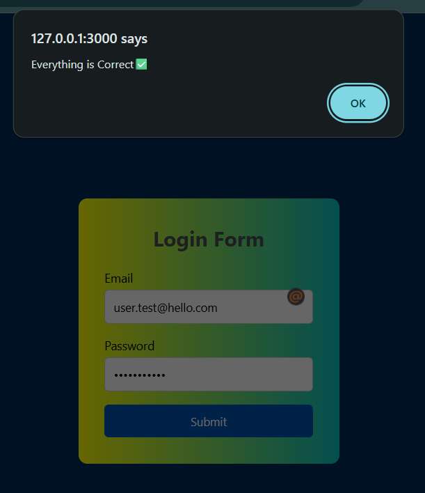
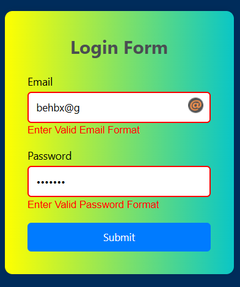

# 🔐 Email & Password Validator

A clean, client-side **Login Form Validator** built with vanilla HTML, CSS, and JavaScript. Validates email format and password strength using **Regex** before form submission — with real-time error feedback and a polished UI.

---

## 📸 Screenshots

> _Add your screenshots here_

| Valid Input | Invalid Input |
|---|---|
|  |  |

---

## ✨ Features

- 📧 **Email Format Validation** — Checks that the email follows a standard `user@domain.com` format
- 🔑 **Password Strength Validation** — Enforces at least one uppercase, one lowercase, one digit, one special character, and a minimum length of 6
- 🔴 **Inline Error Messages** — Red border and error text appear below invalid fields
- ✅ **Success Alert** — Confirms correct input and clears the form on valid submission
- 🎨 **Styled UI** — Gradient card on a deep navy background with hover effects on the button
- 🧠 **Smart Reset** — Error styles are cleared each time the form is re-submitted so stale errors don't linger

---

## 🚀 Getting Started

### No installation needed!

1. **Clone the repository**
   ```bash
   git clone https://github.com/your-username/email-password-validator.git
   cd email-password-validator
   ```

2. **Open in browser**

   Just double-click `index.html` or open it with a Live Server extension in VS Code.

---

## 🧠 How It Works

Validation runs on form submit via an event listener. Two regex patterns do the heavy lifting:

```js
// Email: must have characters, @, a domain, and a TLD
const emailRegex = /^[^\s@]+@[^\s@]+\.[^\s@]+$/;

// Password: min 6 chars, must include uppercase, lowercase, digit, special char
const passwordRegex = /^(?=.*[a-z])(?=.*[A-Z])(?=.*\d)(?=.*[@$!%*?&]).{6,}$/;
```

### Validation Flow

```
User clicks Submit
       │
       ▼
Reset all borders and error messages (clean slate)
       │
       ├── Password fails regex? → Red border + error message, isValid = false
       │
       ├── Email fails regex?    → Red border + error message, isValid = false
       │
       └── isValid = true?       → Alert success + clear inputs
```

### Password Rules at a Glance

| Rule | Requirement |
|---|---|
| Minimum length | 6 characters |
| Uppercase letter | At least one (A–Z) |
| Lowercase letter | At least one (a–z) |
| Number | At least one (0–9) |
| Special character | At least one (`@$!%*?&`) |

---

## 📁 Project Structure

```
email-password-validator/
├── index.html     # Form markup
├── style.css      # All styling
├── script.js      # Regex validation logic
└── README.md
└── screenshots📁
```

---

## 🛠️ Built With

- **HTML5** — Semantic form structure
- **CSS3** — Gradient card, flexbox layout, hover effects
- **Vanilla JavaScript** — Regex-based validation, DOM manipulation

---

## 📄 License

This project is open source and available under the [MIT License](./LICENSE).

---

## 🙋‍♂️ Author

**Your Name**
- GitHub: [MANEEVAR1](https://github.com/MANEEVAR1)