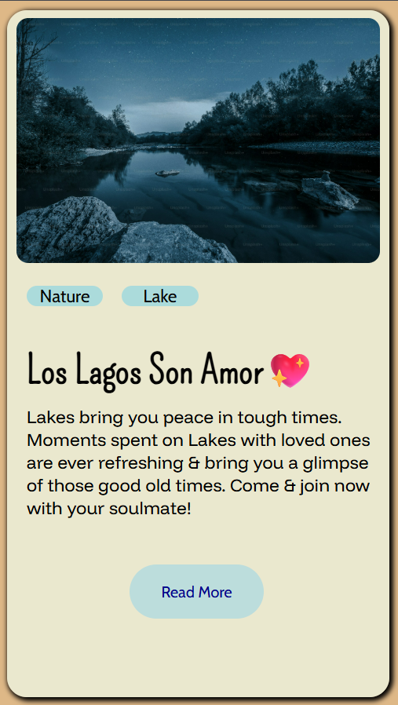

# 🌊 Lake Visit Card — CSS Practice Project

A simple, aesthetic travel card UI built as a CSS practice project. It showcases a serene lake destination card with layered typography, a hero image, and a soft call-to-action — the kind of card you'd find on a travel or lifestyle website.

---

## 📸 Preview


---

## 🛠️ Built With

- **HTML5** — semantic and clean structure
- **CSS3** — layout, typography, spacing, and card styling
- **Google Fonts** — Pompiere, Funnel Display, and Cabin for a warm, editorial feel
- **Unsplash** — high-quality lake photography for the hero image

---

## 🎯 What I Practiced

This was a focused CSS exercise. Key concepts I worked on:

- Card layout and box model
- Font pairing and typographic hierarchy
- Layering text over/around images
- Spacing, sizing, and visual balance
- Hover-ready button styling

---

## 📁 Project Structure

```
css-card-challenge/
├── index.html
└── style.css
```

---

## 🚀 Getting Started

No frameworks, no dependencies — just open it in a browser.

```bash
git clone https://github.com/your-username/css-lake-card.git
cd css-lake-card
# Open index.html in your browser
```

---

## 💡 Notes

This is a mini front-end practice project and not a full website. The "Read More" button is currently a static UI element with no linked page. The card is designed for desktop view — responsive improvements are a potential next step.

---

## 📬 Connect

Made with curiosity and a love for clean UI. Feel free to fork it, tweak it, or use it as a starting point for your own card components!