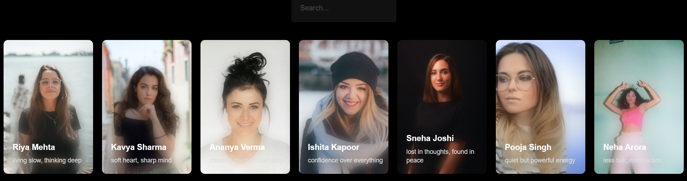

# 🃏 Profile Card Search UI

A visually rich **user profile card gallery** with live search, built with vanilla HTML, CSS, and JavaScript — styled with Tailwind CSS. Features a dark aesthetic, frosted glass blur effect on cards, and instant name-based filtering as you type.

---

## 📸 Screenshots

> _Add your screenshots here_

| All Cards | Search in Action |
|---|---|
|  |  |

---

## ✨ Features

- 🔍 **Live Search** — Filters cards in real time as you type, matched by name prefix
- 🃏 **Dynamic Card Rendering** — All cards are generated from a JavaScript data array, no hardcoded HTML
- 🌫️ **Frosted Blur Effect** — A blurred version of the profile image bleeds into the card bottom for a glassmorphism-style look
- 🌑 **Dark UI** — Full black background with dark search input for a sleek, modern feel
- 💡 **Easy to Extend** — Just add a new object to the `users` array to add more profile cards

---

## 🚀 Getting Started

### No installation needed (to just run it)!

1. **Clone the repository**
   ```bash
   git clone https://github.com/your-username/profile-card-search.git
   cd profile-card-search
   ```

2. **Open in browser**

   Double-click `index.html` or use the VS Code Live Server extension.

3. _(Optional)_ **Rebuild Tailwind CSS**

   Only needed if you change Tailwind utility classes:
   ```bash
   npm install
   npx tailwindcss -i ./src/input.css -o ./src/output.css --watch
   ```

---

## 🧠 How It Works

### Card Rendering

Cards are not written in HTML — they are built dynamically from a `users` array in JavaScript:

```js
let users = [
  {
    name: "Riya Mehta",
    pic: "https://...",
    bio: "living slow, thinking deep",
  },
  // ...more users
];
```

The `showUsers()` function loops over the array and creates the full card structure (image, blurred layer, name, bio) using `document.createElement` and appends each card to `.cards`.

### Blur Effect

Each card has two layers stacked on top of each other:

```
┌─────────────────────────┐
│  .bg-img (full photo)   │  ← actual profile image
│  .blurred-layer         │  ← same image, blurred, masked to bottom
│  .content (name + bio)  │  ← text sits above both
└─────────────────────────┘
```

The blurred layer uses a CSS `mask-image` that fades from solid at the bottom to transparent at the top — so only the bottom portion looks frosted.

### Live Search

```js
inp.addEventListener("input", findUser);

function findUser() {
  let newUsers = users.filter((user) =>
    user.name.startsWith(inp.value)
  );
  document.querySelector(".cards").innerHTML = "";
  showUsers(newUsers);
}
```

On every keystroke, the cards container is cleared and re-rendered with only the matching users.

---

## ➕ Adding More Users

Open `script.js` and add a new object to the `users` array:

```js
{
  name: "Your Name",
  pic: "https://link-to-image.com/photo.jpg",
  bio: "your one-line vibe here",
},
```

That's it — the card renders automatically.

---

## 📁 Project Structure

```
profile-card-search/
├── index.html        # Markup and layout
├── style.css         # Card styles, blur effect, dark theme
├── script.js         # User data, card rendering, search logic
├── src/
│   ├── input.css     # Tailwind input (if used)
│   └── output.css    # Compiled Tailwind CSS
├── screenshots/
│   ├── all-cards.png     
│   └── search-result.png
└── README.md
```

---

## 🛠️ Built With

- **HTML5** — Structure
- **CSS3** — Card layout, blur effect, mask-image, box-shadow
- **Tailwind CSS** — Search input and flex layout utilities
- **Vanilla JavaScript** — Dynamic rendering, array filtering, DOM manipulation

---

## 📄 License

This project is open source and available under the [MIT License](./LICENSE).

---

## 🙋‍♂️ Author

**Your Name**
- GitHub: [@MANEEVAR1](https://github.com/MANEEVAR1)