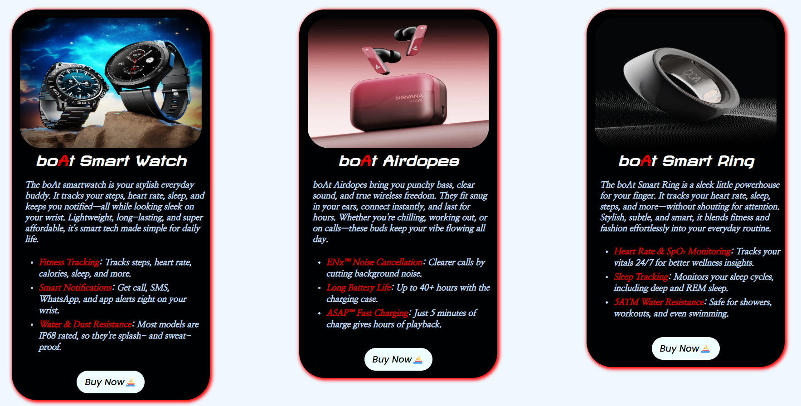

# boAt Product Catalogue Card 🛶

A mini front-end practice project — a clean, responsive product catalogue built with HTML and CSS, showcasing three boAt lifestyle products.

---

## 📸 Preview

Three product cards featuring:
- **boAt Smart Watch** — fitness tracking & smart notifications
- **boAt Airdopes** — true wireless earphones with ENx™ noise cancellation
- **boAt Smart Ring** — subtle health & wellness tracker

---

## 🛠️ Built With

- **HTML5** — semantic structure and layout
- **CSS3** — card styling, typography, and visual design
- **Google Fonts** — Poppins, Nanum Myeongjo, Revalia

---

## 📁 Project Structure

```
├── index.html      # Main HTML file with all three product cards
└── style.css       # All card and layout styles
```

---

## 🚀 Getting Started

No setup or dependencies needed — just open `index.html` in your browser and you're good to go.

```bash
git clone https://github.com/your-username/boat-catalogue-card.git
cd boat-catalogue-card
# Open index.html in your browser
```

---

## 🎯 What I Practiced

- Building reusable card components with a consistent layout
- Using external fonts and applying custom typographic styles
- Structuring content with semantic HTML (lists, divs, anchors)
- Linking external product images and URLs

---

## 📌 Notes

- Product images are loaded from boAt's Shopify CDN — an internet connection is required to display them.
- The "Buy Now" buttons link directly to the official [boAt Lifestyle](https://www.boat-lifestyle.com/) store.
- This is a purely front-end practice project with no backend or framework involved.

---

## 📄 License

This project is open for learning and reference. Product names, images, and branding belong to [boAt Lifestyle](https://www.boat-lifestyle.com/).